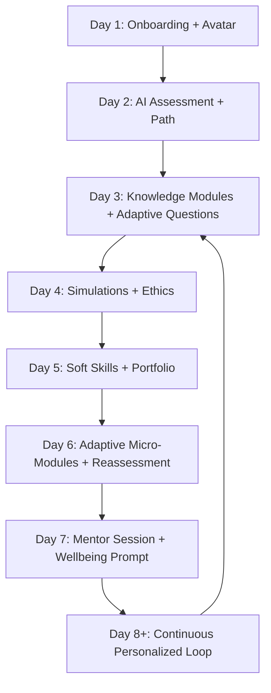
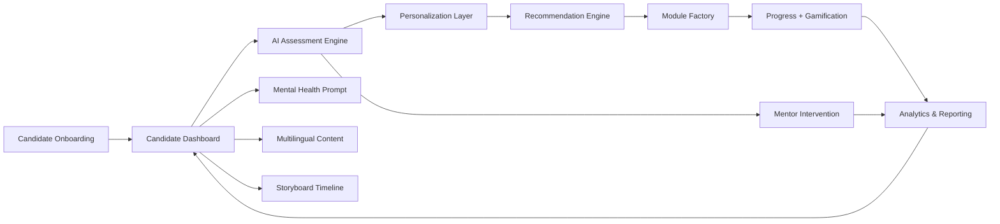

# LegalAI / BarNavigator™ Prototype

AI-powered legal competency platform prototype for tracking bar-exam readiness, generating adaptive learning plans, and recommending high-impact next steps.

## Implemented Modules

- **Candidate Dashboard Data Model**: topic mastery, soft skills, ethics, goals, points, badges, and progress tracking.
- **AI Assessment Engine**: strengths, weaknesses, repeated errors, behavioral risk flags, readiness/pass probability.
- **Personalization Layer**: adaptive paths from knowledge gaps + learning style + neurodiversity supports.
- **Recommendation Engine**: prioritized study modules, timed simulations, coaching, and mentorship.
- **Experience Layer**: module factory, progress tracking, gamification hooks, mentor intervention flow, mental-health prompts.
- **Storyboard Engine**: day-by-day candidate journey (Day 1 onboarding through Day 8+ continuous loop).
- **Multilingual Support**: lightweight translation wrapper for candidate-facing content.
- **Analytics & Reporting**: candidate snapshot and mock-score trend.

## Candidate Interactive Storyboard Flow



## Data Flow (System)



## Project Structure

- `bar_navigator/models.py` - core entities and typed output contracts.
- `bar_navigator/assessment.py` - AI assessment heuristics.
- `bar_navigator/personalization.py` - adaptive learning-path builder.
- `bar_navigator/recommendation.py` - next-step ranking engine.
- `bar_navigator/experience.py` - inclusive learning modules, gamification helpers, mentor/wellbeing components.
- `bar_navigator/storyboard.py` - day-by-day storyboard timeline builder.
- `bar_navigator/analytics.py` - dashboard/reporting helpers.
- `bar_navigator/pipeline.py` - end-to-end orchestration service.
- `tests/test_pipeline.py` - baseline integration test.

## Quick Start

```bash
python -m pip install pytest
pytest -q
```
